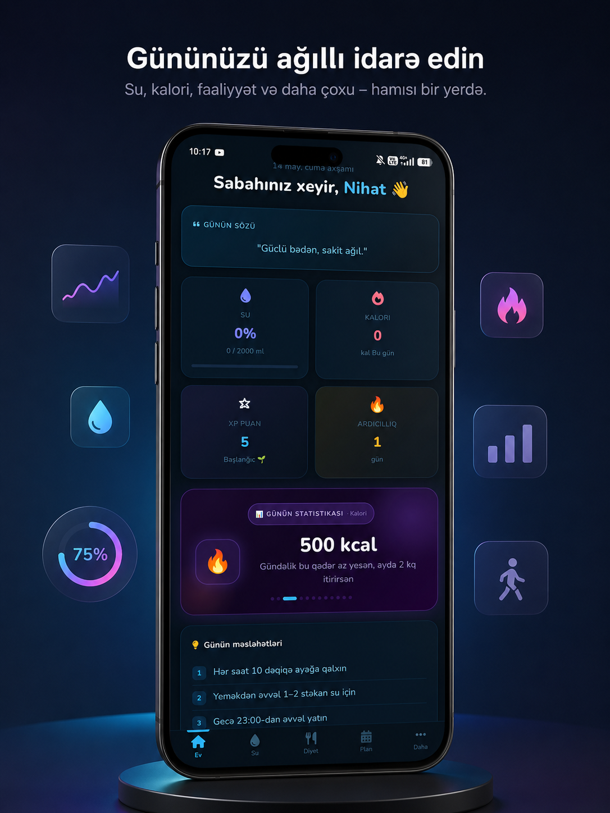
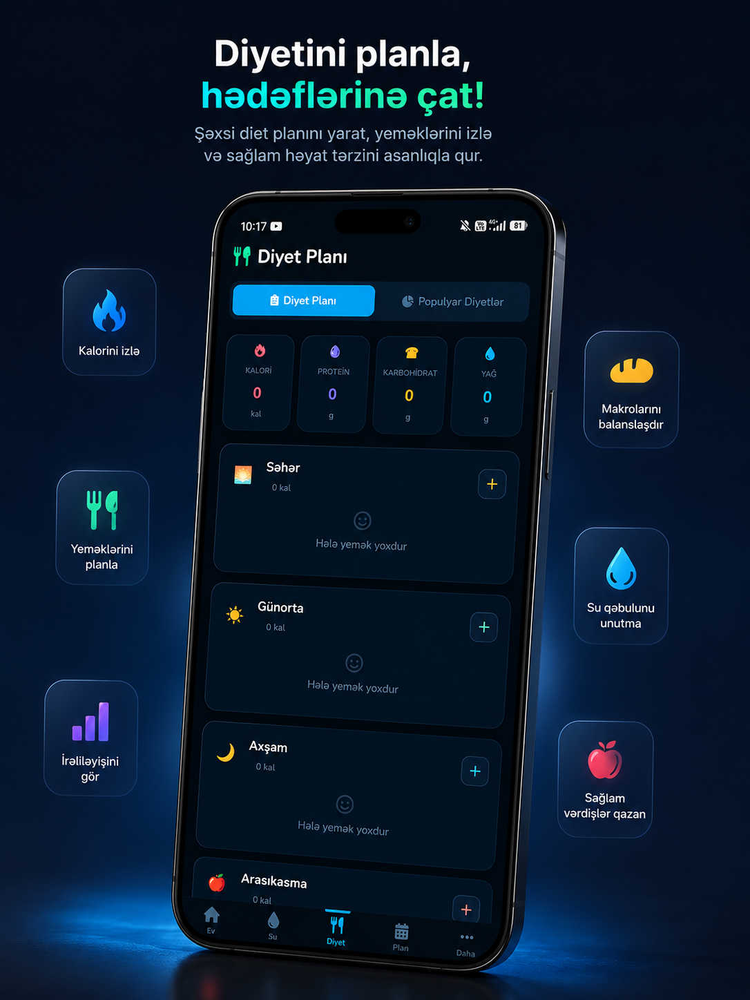

# 📱 Ech-Daily — Your Daily Health Companion

**Ech-Daily** is a modern and user-friendly mobile application designed to manage a healthy lifestyle. Tracking your daily diet, monitoring water intake, and planning your routines is now easier than ever![cite: 1]

## ✨ Key Features

* **🍎 Daily Diet Plan:** Record your meal times and menus to keep your nutrition under control.[cite: 1]
* **💧 Water Tracker:** Monitor your daily water intake and stay hydrated throughout the day.[cite: 1]
* **📅 Routine Management:** Organize your daily tasks and workouts to manage your time more efficiently.[cite: 1]
* **🎨 Modern Design:** A clean, fast, and visually appealing user interface that is easy on the eyes.[cite: 1]

## 📸 Screenshots

  
  

## 🚀 Download

You can download the application directly to your Android device using the link below:[cite: 1]

[**📥 Download Ech-Daily APK**](https://github.com/lazgiyew/Ech-Daily/raw/main/Ech%20Daily.apk)

### 🛠 Installation Steps:
1. Download the `Ech Daily.apk` file to your phone.[cite: 1]
2. Enable "Install from unknown sources" in your phone's settings.[cite: 1]
3. Open the file and follow the prompts to install.[cite: 1]

## 💻 Tech Stack
* **Frontend:** HTML, CSS, JavaScript[cite: 2]
* **Mobile:** Capacitor / Android Studio[cite: 2]

---

Developed by <a href="https://github.com/lazgiyew">lazgiyew</a>

